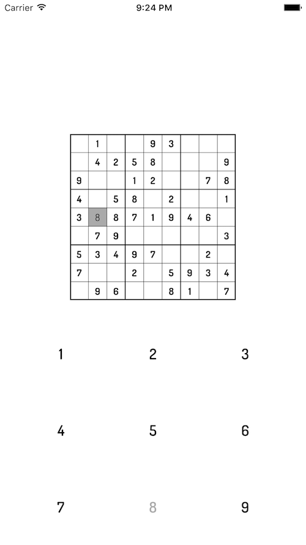
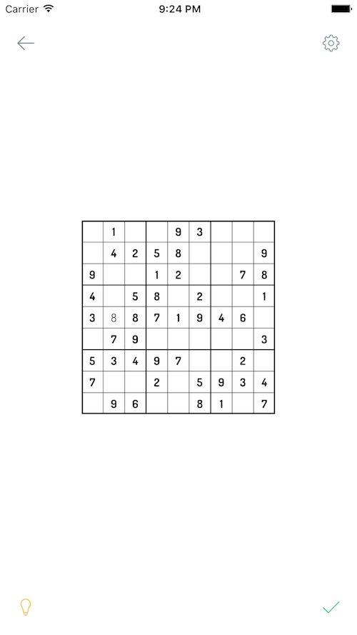

# Sudoku
Sudoku puzzle generator on iOS written in Swift using Algorithm X



## Overview
Sudoku was built as a result of experimentation with Swift and [Algorithm X by Donald Knuth](http://www-cs-faculty.stanford.edu/~uno/papers/dancing-color.ps.gz) to solve a 9x9 Sudoku puzzle. Also, the app uses the MVVM architecture and features animations and custom transitions to augment a user's experience. The app depends on [Interstellar](https://github.com/JensRavens/Interstellar) for implementing a reactive paradigm and [EDStorage](https://github.com/thisandagain/storage) for simplifying storing data on iOS. 

## Sudoku Solver
In order to solve a Sudoku board, I used a modified version of Algorithm X to solve an exact cover problem. The idea behind Algorithm X is to select a row that corresponds to a column in a matrix and to remove all the other rows that satisfy columns that are already satisfied by the selected row. This way, the final set of selected squares contains exactly one match for every column. In Sudoku, if the rows are every possible number for every possible square on the board and the columns are each of the Sudoku rules (every number must appear once in every row, column, and 3x3 box), this algorithm will find a solution to the puzzle. Knuth introduces Algorithm X as a use for Dancing Links, where nodes in a doubly linked list can be removed and reinserted in a backtracking search. I quickly found that implementing a doubly linked list in Swift was a hassle, so I tried finding a better way of selecting an deselecting rows. I found an [implementation in Python](http://www.cs.mcgill.ca/~aassaf9/python/algorithm_x.html) that used dictionaries instead of linked lists, and thought it would be a better fit for my need.

Here's my solve function: 

```swift
func solve() -> [Square]?
{
	if x.isEmpty
	{
		return []
	}
	if x.first!.1.isEmpty
	{
		return nil
	}
	
	let c = x.sort { $0.1.count < $1.1.count }.first!.0
	for r in x[c]!.shuffle()
	{
		let cols = select(r)
		if let solved = solve()
		{
			deselect(r, cols: cols)
			return [r] + solved
		}
		else
		{
			deselect(r, cols: cols)
		}
	}
	return nil
}
```
where x is a dictionary with constraints as keys and an array of rows that satisfy the constraint as values.

## MVVM
I was using MVVM in my other projects that had to fetch data from the internet because it lended itself well to asynchronous calls. Although I had not planned on using it for this project, I realized that it would come in handy because the solve function was taking too long. So, I moved the solve function to the background thread in the view model and subscribed to it in my view. Interstellar is great because it is very light-weight and gets the job done as far as reactive programming, so I was happy to find a use for it in another project. Interstellar also greatly simplifies multithreading, making it even more useful.
